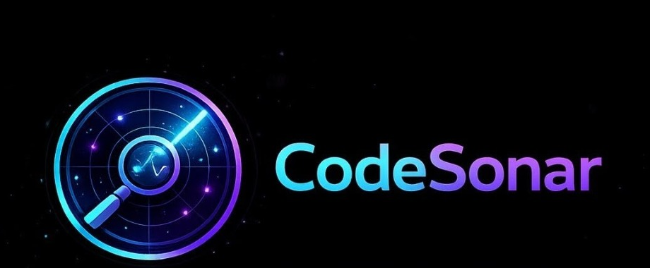
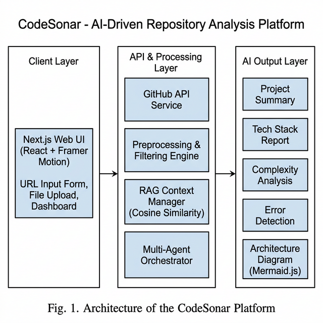
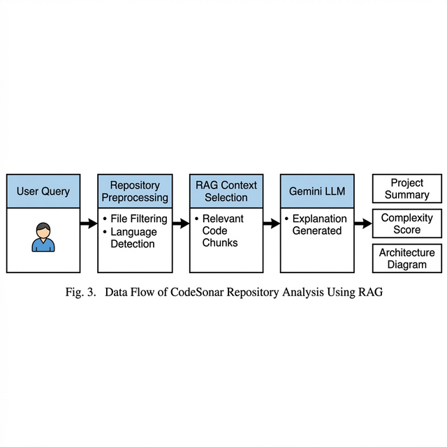
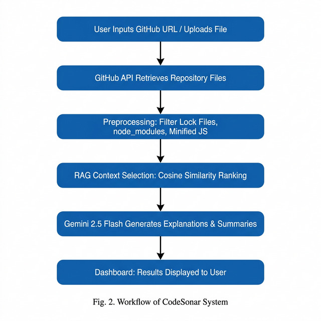

<!-- ========================================== -->
<!--         CODESONAR - README.md              -->
<!-- ========================================== -->

<!-- 1. PROJECT TITLE + TAGLINE -->

<p align="center">
  
</p>

<h1 align="center">CodeSonar</h1>

<p align="center">
  <strong>AI-powered codebase analysis, vulnerability detection, and immersive 3D architecture visualization for developers.</strong>
</p>

<br />

<!-- 18. BADGES -->

<p align="center">
  <a href="LICENSE"></a>
  <a href="https://github.com/Rohanranga/3d-repo-analyser/stargazers"></a>
  <a href="https://github.com/Rohanranga/3d-repo-analyser/network/members"></a>
  <a href="https://github.com/Rohanranga/3d-repo-analyser/issues"></a>
</p>

<p align="center">
  <a href="https://nextjs.org/"></a>
  <a href="https://react.dev/"></a>
  <a href="https://www.typescriptlang.org/"></a>
  <a href="https://ai.google.dev/"></a>
  <a href="https://threejs.org/"></a>
  <a href="https://www.electronjs.org/"></a>
  <a href="https://tailwindcss.com/"></a>
</p>

---

<!-- 3. SHORT INTRODUCTION -->

## What is CodeSonar?

CodeSonar is an AI-powered platform that helps developers **analyze**, **secure**, and **understand** complex codebases using intelligent multi-agent analysis, real-time vulnerability detection, and an immersive **3D architecture visualization** where you fly through your code like a city. Paste a GitHub URL and get a complete understanding of any repository in under 90 seconds -- no setup, no database, nothing stored.

---

<!-- 4. PROBLEM STATEMENT -->

## Problem Statement

Modern codebases are becoming increasingly complex, making it difficult for developers to:

- **Understand project architecture** -- Hundreds of files across nested directories with no clear entry point
- **Detect vulnerabilities early** -- Security issues hide in plain sight across interconnected modules
- **Navigate AI-generated code** -- AI assistants scaffold entire projects, but the resulting code is opaque even to the developers who prompted it
- **Onboard to existing projects** -- Mid-project joiners spend weeks reading code before contributing a single line
- **Learn from real-world projects** -- Freshers and students face an enormous barrier when trying to learn from production codebases
- **Track dependencies and technical debt** -- Understanding how modules relate requires mentally parsing import chains across the entire codebase
- **Visualize relationships between modules** -- Text-heavy static analysis tools provide data but lack interactive, spatial understanding

Traditional static analysis tools like SonarQube, ESLint, and PMD check syntax and flag anti-patterns -- but they never explain **intent**, **design decisions**, or **how everything connects**. Documentation generators only work when comments already exist. The result: onboarding is painful, code review is shallow, and real understanding is left to experience and luck.

---

<!-- 5. SOLUTION -->

## Solution

CodeSonar combines **AI-driven code intelligence** with **interactive 3D visualization** to provide:

- **Multi-agent RAG analysis** -- 5 specialized AI agents powered by Google Gemini, each receiving only the most relevant code context via Retrieval-Augmented Generation
- **Smart vulnerability detection** -- Goes beyond pattern matching; the AI understands semantic context to find bugs that linters miss (2.5x more issues found vs. conventional tools)
- **Plain-language explanations** -- Every file explained in human-readable prose: what it does, how it works, why it matters
- **Interactive architecture diagrams** -- Auto-generated flowcharts showing real data flow between modules
- **Immersive 3D code city** -- Navigate your codebase as a 3D environment where files are buildings, dependencies are glowing edges, and you fly through the architecture with WASD controls
- **AI chatbot for follow-ups** -- Ask questions grounded in the actual repository content, not generic LLM knowledge
- **Zero data retention** -- Nothing is stored to disk. Analyze proprietary code without privacy concerns.

---

<!-- 6. FEATURES -->

## Features

### Analysis & Intelligence

| | Feature | Description |
|---|---------|-------------|
| **AI agents** | 5 Specialized AI Agents | Tech Stack, Complexity, Improvement, Bug & Security, and Summary agents -- each with RAG-focused context |
| **RAG** | RAG-Powered Context Retrieval | TF-IDF cosine similarity ranks every code segment; only top-K chunks reach the AI |
| **Explanations** | File-by-File Explanations | Plain-language breakdown of every file: what it does, patterns used, role in the project |
| **Bugs** | Bug & Security Detection | XSS, SQL injection, hardcoded credentials, race conditions, memory leaks, missing validation |
| **Quality** | Code Quality Scoring | Complexity score (1-10) with justification covering cyclomatic complexity, coupling, duplication |
| **Improvements** | Improvement Suggestions | Actionable recommendations with current code vs. suggested code diffs, priority, and effort |
| **Packages** | Package Version Analysis | Detects outdated dependencies and flags packages needing updates |

### Visualization & Exploration

| | Feature | Description |
|---|---------|-------------|
| **3D** | 3D Code Explorer | Fly through your codebase as an immersive 3D city -- **the biggest attention-grabber** |
| **Architecture** | Interactive Architecture Diagrams | Auto-generated Mermaid.js flowcharts showing real data flow, downloadable as images |
| **3D AI** | AI Assistant in 3D | Ask questions about specific "buildings" (modules) or "rooms" (functions) inside the 3D world |
| **HUD** | 3D HUD Overlay | Node info panels, error panels, and navigation controls overlaid on the 3D scene |

### Developer Experience

| | Feature | Description |
|---|---------|-------------|
| **Chat** | AI Chatbot | Follow-up Q&A grounded in repository context ("Why does auth bypass middleware?") |
| **PDF** | PDF Report Export | Download the full analysis as a formatted A4 PDF with all findings and recommendations |
| **Input** | Dual Input Modes | Paste a GitHub URL or drag-and-drop a source file |
| **Private** | Private Repo Support | Bring your own Gemini API key to analyze private codebases |
| **Desktop** | Desktop App | Electron application with Windows installer (NSIS) for offline-capable usage |
| **GPT** | Custom GPT Integration | QR code links to a ChatGPT Custom GPT for project-specific Q&A |

---

<!-- 7. SCREENSHOTS / DEMO -->

## Screenshots

> **Add your screenshots to a `screenshots/` directory and replace the placeholder paths below.**

### Dashboard
<!--  -->
> `screenshots/dashboard.png` -- Full analysis results with summary cards, tech stack, complexity score, errors, warnings, and metrics

### 3D Code Explorer
<!--  -->
> `screenshots/3d-explorer.png` -- Immersive WebGL environment where files are buildings and dependencies are glowing edges. **This is your biggest visual differentiator -- highlight it everywhere.**

### Architecture Diagram
<!--  -->
> `screenshots/architecture-diagram.png` -- Auto-generated interactive Mermaid.js flowchart of the project's data flow

### AI Chatbot
<!--  -->
> `screenshots/chatbot.png` -- Follow-up Q&A grounded in the analyzed repository context

### Bug & Security Report
<!--  -->
> `screenshots/bug-report.png` -- Detected errors and warnings with severity, fix suggestions, and code examples

### Hero Landing Page
<!--  -->
> `screenshots/hero.png` -- Landing page with GitHub URL input, file upload, and animated 3D Spline robot scene

### Private Mode
<!--  -->
> `screenshots/private-mode.png` -- Bring-your-own-API-key interface for analyzing private repositories

### PDF Export
<!--  -->
> `screenshots/pdf-export.png` -- Downloadable analysis report formatted as an A4 PDF

---

<!-- 19. DEMO VIDEO -->

## Demo Video

<!-- Replace with your actual YouTube link or GIF -->

<!--
[](https://www.youtube.com/watch?v=YOUR_VIDEO_ID)
-->

<!--
<p align="center">
  
</p>
-->

> **Add a demo video or GIF walkthrough showing:**
> 1. Pasting a GitHub URL into the input
> 2. The animated loading screen with real-time pipeline progress
> 3. The dashboard populating with results
> 4. Expanding the architecture diagram
> 5. Asking a question in the AI chatbot
> 6. Flying through the 3D code explorer
>
> **Tools:** [ScreenToGif](https://www.screentogif.com/) | [Kap](https://getkap.co/) | [OBS Studio](https://obsproject.com/)
>
> Upload to YouTube and replace `YOUR_VIDEO_ID` above, or save a GIF to `screenshots/demo.gif`.

---

<!-- 8. ARCHITECTURE DIAGRAM -->

## Architecture

CodeSonar uses a **three-tier architecture** where the frontend, backend, and AI layer all live in a single Next.js codebase. No database -- everything is processed in-memory and discarded after the response.

<p align="center">
  
</p>
<p align="center"><em>Fig 1. Three-Tier Architecture of the CodeSonar Platform</em></p>

```
+-------------------------------------------------------------------+
|                        CLIENT (Browser)                           |
|  React 19 + Tailwind CSS 4 + Framer Motion + Three.js             |
|  +----------+ +--------------+ +------------+ +--------------+   |
|  |   Hero   | |  Dashboard   | | 3D Explorer| |   Chatbot    |   |
|  |  + Input | |  + Summary   | |  (WebGL)   | |  (Gemini)    |   |
|  +----+-----+ +------+-------+ +-----+------+ +------+-------+   |
+-------|--------------|--------------|-----------------|-----------+
        |              |              |                 |
        v              v              v                 v
+-------------------------------------------------------------------+
|                    SERVER (Next.js API Routes)                     |
|  +--------------+  +-------------+  +-------------------------+   |
|  | /api/analyze |  | /api/chat   |  | /api/explain-node       |   |
|  | (Full        |  | (Follow-up) |  | (3D node details)       |   |
|  |  pipeline)   |  |             |  |                         |   |
|  +------+-------+  +------+------+  +--------+---------------+   |
|         |                  |                   |                   |
|    +----v------------------v-------------------v-----------+      |
|    |            RAG Context Builder                        |      |
|    |  Filter -> Rank by Cosine Similarity -> Top-K         |      |
|    +----+--------------------------------------------------+      |
+---------|----------------------------------------------------------+
          |
          v
+-------------------------------------------------------------------+
|                    AI LAYER (Google Gemini 2.5 Flash)              |
|  +------------+ +------------+ +--------------+ +-------------+  |
|  | Tech Stack | | Complexity | | Improvement  | | Bug &       |  |
|  |   Agent    |>|   Agent    |>|    Agent     |>| Explanation |  |
|  +------------+ +------------+ +--------------+ |   Agent     |  |
|                                                  +------+------+  |
|                                                         v         |
|                                                  +-------------+  |
|                                                  |   Summary   |  |
|                                                  |    Agent    |  |
|                                                  +-------------+  |
+-------------------------------------------------------------------+
```

### RAG Data Flow

<p align="center">
  
</p>
<p align="center"><em>Fig 2. RAG-Based Data Flow from User Query to AI Output</em></p>

---

<!-- 10. WORKFLOW / HOW IT WORKS -->

## How It Works

<p align="center">
  
</p>
<p align="center"><em>Fig 3. End-to-End Workflow of the CodeSonar Analysis Pipeline</em></p>

| Step | What Happens |
|:----:|-------------|
| **1** | User pastes a GitHub URL or drops a source file into the upload area |
| **2** | Server fetches all source files via the GitHub Contents API (Octokit) |
| **3** | Lock files, `node_modules`, minified scripts, and source maps are filtered out |
| **4** | Retained files are split into chunks and ranked by TF-IDF cosine similarity |
| **5** | **Tech Stack Agent** identifies languages, frameworks, tools from imports and configs |
| **6** | **Complexity Agent** scores cyclomatic complexity, coupling, duplication (1-10) |
| **7** | **Improvement Agent** finds actionable refactoring, security, and performance fixes |
| **8** | **Bug & Explanation Agent** detects vulnerabilities + writes per-file explanations |
| **9** | Architecture diagram is generated from the import/require graph in parallel |
| **10** | **Summary Agent** synthesizes everything into a comprehensive project overview |
| **11** | All output is assembled and delivered to the dashboard (typically 60-90 seconds) |

---

<!-- 9. TECH STACK -->

## Tech Stack

### Frontend
| Technology | Purpose |
|-----------|---------|
| React 19 | Component-based UI |
| Next.js 16 | Full-stack framework with API routes |
| TypeScript 5 | Type-safe development |
| Tailwind CSS 4 | Utility-first styling |
| Framer Motion | Animations, transitions, micro-interactions |
| Lucide React | Iconography |

### 3D Visualization
| Technology | Purpose |
|-----------|---------|
| Three.js (r184) | 3D code explorer engine |
| React Three Fiber | React renderer for Three.js |
| @react-three/drei | Camera controls, Stars, helpers |
| @react-three/postprocessing | Bloom, glow effects |
| @react-three/xr | WebXR / VR support (future) |
| Spline | Hero section 3D robot scene |

### AI & Analysis
| Technology | Purpose |
|-----------|---------|
| Google Gemini 2.5 Flash | Multi-agent RAG analysis, chat, code explanation |
| @google/generative-ai | Direct Gemini API SDK |
| TF-IDF + Cosine Similarity | RAG context retrieval and ranking |

### Data & Export
| Technology | Purpose |
|-----------|---------|
| Octokit | GitHub API repository fetching |
| Mermaid.js | Architecture diagram rendering |
| jsPDF | Client-side PDF report generation |
| html-to-image | Diagram export as JPG |
| react-markdown + remark-gfm | Rich text rendering |
| qrcode | SVG QR code generation |

### Desktop
| Technology | Purpose |
|-----------|---------|
| Electron 41 | Desktop application shell |
| electron-builder | Windows installer (NSIS) |

---

<!-- 11. INSTALLATION GUIDE -->

## Installation

### Prerequisites

- **Node.js** 18+ (v20 recommended)
- **Google Gemini API Key** -- [Get one free here](https://aistudio.google.com/apikey)

### Quick Start

```bash
# 1. Clone the repository
git clone https://github.com/Rohanranga/3d-repo-analyser.git
cd 3d-repo-analyser

# 2. Install dependencies
npm install

# 3. Set up environment variables
cp .env.example .env.local

# 4. Add your API key (see Environment Variables below)

# 5. Start the development server
npm run dev
```

Open [http://localhost:3000](http://localhost:3000) in your browser.

### Build Commands

```bash
# Production build
npm run build && npm start

# Desktop app (Windows .exe)
npm run build:electron
# Output: dist-electron/
```

---

<!-- 12. ENVIRONMENT VARIABLES -->

## Environment Variables

Create a `.env.local` file in the project root:

```env
# Required -- Google Gemini API key for AI analysis
GOOGLE_GENAI_API_KEY=your_gemini_api_key_here

# Optional -- Override the default model (default: gemini-2.0-flash)
GOOGLE_MODEL_NAME=gemini-2.5-flash

# Optional -- GitHub personal access token for higher rate limits
GITHUB_TOKEN=your_github_token_here
```

| Variable | Required | Description |
|----------|:--------:|-------------|
| `GOOGLE_GENAI_API_KEY` | Yes | Google Gemini API key for all AI analysis |
| `GOOGLE_MODEL_NAME` | No | Override the Gemini model (default: `gemini-2.0-flash`) |
| `GITHUB_TOKEN` | No | GitHub PAT for higher API rate limits on large repos |

> **Note:** For private repository analysis, users provide their own API key through the in-app Private Mode interface -- it's never stored.

---

<!-- 13. FOLDER STRUCTURE -->

## Project Structure

```
codesonar/
|
|-- src/
|   |-- app/
|   |   |-- page.tsx                      # Main landing page
|   |   |-- layout.tsx                    # Root layout
|   |   |-- private/page.tsx              # Private repo analysis (BYOK)
|   |   |-- explore/page.tsx              # 3D code explorer page
|   |   +-- api/
|   |       |-- analyze/route.ts          # Full analysis pipeline endpoint
|   |       |-- chat/route.ts             # AI chatbot endpoint
|   |       |-- explain-node/route.ts     # 3D node explanation endpoint
|   |       +-- private-analyze/route.ts  # Private repo analysis endpoint
|   |
|   |-- components/
|   |   |-- home/Hero.tsx                 # Landing hero with 3D Spline scene
|   |   |-- input/RepoInput.tsx           # URL input + file drag-and-drop
|   |   |-- dashboard/
|   |   |   +-- AnalysisDashboard.tsx     # Results dashboard with loading screen
|   |   |-- analysis/
|   |   |   |-- ProjectSummary.tsx        # Summary metrics cards
|   |   |   |-- ArchitectureView.tsx      # Mermaid diagram renderer
|   |   |   |-- DetailedAnalysis.tsx      # Per-file analysis with code viewer
|   |   |   |-- PotentialChanges.tsx      # Improvement suggestions panel
|   |   |   |-- DownloadPDF.tsx           # PDF report generator
|   |   |   +-- SummaryCard.tsx           # Metric display card
|   |   |-- chat/
|   |   |   +-- ChatInterface.tsx         # AI chatbot panel
|   |   |-- explorer3d/
|   |   |   |-- CodeExplorer3D.tsx        # Main 3D scene with fly camera
|   |   |   |-- CodeNode.tsx              # 3D file node (building)
|   |   |   |-- DependencyEdge.tsx        # 3D dependency line
|   |   |   |-- HUDOverlay.tsx            # 3D HUD + node info panels
|   |   |   |-- AIAssistantOverlay.tsx    # In-3D AI chat overlay
|   |   |   |-- SceneEnvironment.tsx      # Lighting + floating particles
|   |   |   +-- usePuzzleInteraction.ts   # Click/select interaction logic
|   |   +-- ui/                           # Shared UI components
|   |
|   |-- lib/
|   |   |-- ai.ts                         # Core AI pipeline (5 agents + chat)
|   |   |-- github.ts                     # GitHub API file fetcher (Octokit)
|   |   |-- code-graph-parser.ts          # Import graph -> 3D graph layout
|   |   |-- simple-architecture.ts        # Mermaid diagram generator
|   |   |-- error-analyzer.ts             # Static error detection fallback
|   |   |-- improvement-analyzer.ts       # Local improvement scanner
|   |   |-- explanation-generator.ts      # Fallback file explainer
|   |   |-- line-by-line-explainer.ts     # Per-line code explanations
|   |   +-- version-analyzer.ts           # Package version checker
|   |
|   +-- types/
|       +-- analysis.ts                   # TypeScript interfaces
|
|-- electron/
|   +-- main.js                           # Electron main process
|
|-- ieee_paper/                           # Published IEEE research paper
|   |-- index.html                        # Full paper (HTML)
|   |-- CodeSonar_IEEE_Paper.docx         # Full paper (Word)
|   +-- figures/                          # Architecture & workflow diagrams
|
|-- public/                               # Static assets & logos
+-- package.json
```

---

<!-- 20. WHY THIS MATTERS / VISION -->

## Why This Matters

### For developers working with AI-generated code

AI coding assistants can scaffold entire projects in minutes, but the resulting codebases are often opaque even to the developers who prompted them. CodeSonar gives you the "second pair of eyes" that explains what the AI actually built, how the pieces connect, and where the hidden issues are.

### For mid-project joiners in organizations

Joining a project mid-stream means weeks of reading code, asking questions, and building mental models before you can contribute meaningfully. CodeSonar compresses that ramp-up from **weeks to minutes**. Paste the repo URL, read the summary, explore the architecture diagram, and ask the chatbot the questions you'd normally bother a senior engineer with.

### For freshers and students

Learning from real-world projects is the fastest way to grow as a developer, but the barrier to entry is enormous. A 20,000-line production codebase has no "start here" button. **CodeSonar creates that button.** It tells you what the project does, breaks down every file, shows you how the modules connect visually, and lets you ask questions in plain language. It turns any open-source project into a learning resource.

### For code reviewers and auditors

CodeSonar's bug detection found **87 confirmed issues** across 10 test repositories -- **61 of which had never been reported**. It outperformed conventional linters by identifying security vulnerabilities, logic bugs, and concurrency issues that pattern-matching rules cannot catch.

---

## Vision

CodeSonar aims to **redefine how developers understand complex software systems** by combining AI reasoning, security analysis, and immersive 3D visualization into a single intelligent platform.

We believe that understanding code should not require weeks of reading. It should not depend on whether the original author left good comments. And it should not be limited to text on a screen -- it should be **spatial, interactive, and intelligent**.

The future we're building toward:
- **Any repository, any platform** -- GitHub, GitLab, Bitbucket, private repos
- **Any developer, any experience level** -- From freshers to principal engineers
- **Any format** -- Web, desktop, VR/AR headsets
- **Real-time collaboration** -- Teams exploring codebases together in shared 3D spaces

---

## Evaluation Results

Tested across 10 open-source repositories of varying sizes (2K-45K lines of code), rated by 3 independent software engineers per repository:

| Repository Size | Accuracy (avg/5) | Specificity (avg/5) | Completeness (avg/5) | Avg. Time |
|----------------|:-:|:-:|:-:|:-:|
| Small (< 5K LOC) | **4.6** | **4.5** | **4.4** | 18s |
| Medium (5-20K LOC) | **4.3** | **4.1** | **4.2** | 42s |
| Large (> 20K LOC) | **3.9** | **3.8** | **3.7** | 89s |

**Key findings:**
- **87 confirmed bugs** found across all repositories; **61 previously unreported**
- Architecture diagrams rated **"helpful" or "very helpful"** by 9/10 evaluators
- RAG-grounded chatbot answers **consistently preferred** over generic LLM responses
- Bug detection outperformed conventional linting by **2.5x**

---

<!-- 14. FUTURE ROADMAP -->

## Roadmap

- [ ] AI-powered code fix suggestions with one-click apply
- [ ] Pull request review assistant
- [ ] GitLab & Bitbucket support
- [ ] Private repo OAuth authentication
- [ ] Hierarchical architecture diagrams (zoom into N-hop subgraphs)
- [ ] Auto-generated test cases from detected bugs
- [ ] Multi-agent reasoning with agent collaboration
- [ ] Cloud deployment (hosted SaaS version)
- [ ] Real-time collaboration (shared 3D exploration)
- [ ] VS Code extension
- [ ] WebXR / VR headset support for 3D explorer
- [ ] Enterprise dashboard with team analytics
- [ ] Cross-repository comparison
- [ ] Historical trend tracking (quality over time)
- [ ] User feedback loop for prompt improvement

---

<!-- 15. CONTRIBUTING -->

## Contributing

Contributions are welcome! Here's how to get started:

1. **Fork** the repository
2. **Create** a feature branch (`git checkout -b feature/amazing-feature`)
3. **Commit** your changes (`git commit -m 'Add amazing feature'`)
4. **Push** to the branch (`git push origin feature/amazing-feature`)
5. **Open** a Pull Request

### Areas where contributions are especially welcome:

- Adding support for GitLab/Bitbucket repository fetching
- Improving the 3D explorer with better node layouts and interactions
- Adding new AI agent types (test generation, documentation, etc.)
- UI/UX improvements to the analysis dashboard
- Writing tests
- Improving accessibility

See the [open issues](https://github.com/Rohanranga/3d-repo-analyser/issues) for a list of known issues and feature requests.

---

## Research Paper

This project is backed by a published **IEEE research paper**: *"CodeSonar: An AI-Driven Platform for GitHub Repository Comprehension Using RAG"*

The full paper is available in [`ieee_paper/index.html`](ieee_paper/index.html).

---

<!-- 16. LICENSE -->

## License

This project is licensed under the **MIT License**. See the [LICENSE](LICENSE) file for details.

---

<!-- 17. CONTACT / LINKS -->

## Contact & Links

| | Link |
|---|------|
| **GitHub** | [github.com/Rohanranga](https://github.com/Rohanranga) |
| **Portfolio** | [ranga-rohan.vercel.app](https://ranga-rohan.vercel.app/) |
| **Codesonar Custom GPT** | [CodeSonar Project Explainer](https://chatgpt.com/g/g-69f0670003f881919c845ae67d7dfd4e-codesonar-project-explainer) |
| **Issues** | [Report a bug or request a feature](https://github.com/Rohanranga/3d-repo-analyser/issues) |

**Built and maintained by [Ranga Rohan](https://ranga-rohan.vercel.app/)**

---

<p align="center">
  
</p>

<p align="center">
  <strong>Stop reading code blind. Let CodeSonar explain it.</strong>
</p>

<p align="center">
  <em>Built with AI. Visualized in 3D. Understood in seconds.</em>
</p>
